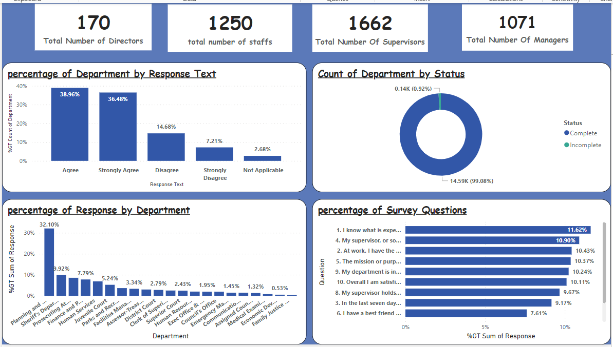

# Employee-Survey-Responses

## Introduction
This Power BI Project is aimed at analysing and drawing out meaningful insights from The **Employee Survey Responses** which are actual responses from an employee engagement survey conducted by Pierce County WA and completed voluntarily by government employees. The dataset is a Single table and contains 14,725 records. The total number of fields is 10.

**_Disclaimer**_; _All data sets report Do not represent any company, institution, or country but just a practice data set to demonstrate the capabilities of Power BI._

## Problem statement
analyze the dataset and provide answers to the questions listed below:

1.Which survey questions did respondents agree with or disagree with most?

2.Do you see any patterns or trends by department or role?

3.As an employer, what steps might you take to improve employee satisfaction based on the survey
results?

## Skills/Concept Demostrated
The following measures where incoperated ;

new measures (sum)

Replaced null values in power query.

## Modelling

this model is a single table schema. the dataset consist of one table that contains all the necessary information about the employee responses to the survey questions. this table serves as the primary source of data, containing all the necessary information in one place without the need for additional tables or links.

## Visualization
the report contains a single page dashboard

## Analysis

1.11.56%  Agreed  with the survey question “ my department is inclusive and demonstrates support for a diverse workforce”, this is consistent with the planning and public works deparment while 21.69% disagrees with the survey question “I have a best friend at work”.
   
2.Based on their status from the data set 0.92% had incomplete status and 99.08% had complete status.

The planning and public works department had the highest response of 32.10% to the survey questions. With a total number of directors of 37, 530 staffs, 664 supervisors and 338 managers,
family and justice department had no participation in the survey this is because there are no employees in this department (Staffs, directors, managers or supervisors), followed by economic development with just 0.53% with a total number of staffs as 10 and 10 managers.
 
2.68% of survey responses are not applicable.

The least response to the survey questions across all departments  is ‘’This last year I have had the opportunity at work to learn and grow’’ this shows that some employees have less developmental oppurtunities.

3. ## Conclusion and Recommendation
Employee satisfaction is the intangible yet powerful force that facilitates more engaged and productive workplaces. Happier employees are naturally more inclined to do their jobs better and for much longer than their dissatisfied counterparts.

1.Recognize employees for their work
Regardless of the job, Employees want to feel respected in the workplace as well as appreciated for the work you do. Employees are more satisfied in their positions when they feel respected and praised for a job well done, even if it’s a simple thank you from a manager. Supervisors are often vocal when an employee makes a mistake or something is needed of them but making the same effort to congratulate or voice appreciation can have a positive influence on worker’s satisfaction.

2.Provide personal development opportunities
An important part of satisfying employees involves providing a path for personal development, Though they function as a part of the organization, individuals/Employees want to feel that there is also room for their personal aspirations to be nurtured.

3.Clear communication and feedback
Your internal communications systems connect all parts of your organization and play a big role in keeping the lines of communication open between staffs and department lead. This is because clear communication results in faster decisions and less frustration, making it easier for employees to focus on the task at hand. Intranet tools provide one centralized system to streamline workflows and facilitate feedback.

4. Enhance job security
Make sure employees know their jobs are stable. Job insecurity can lead to anxiety that may affect job performance. However, employees who feel confident and secure in their positions may be more eager to invest in the company.

Thanks for Reading..

